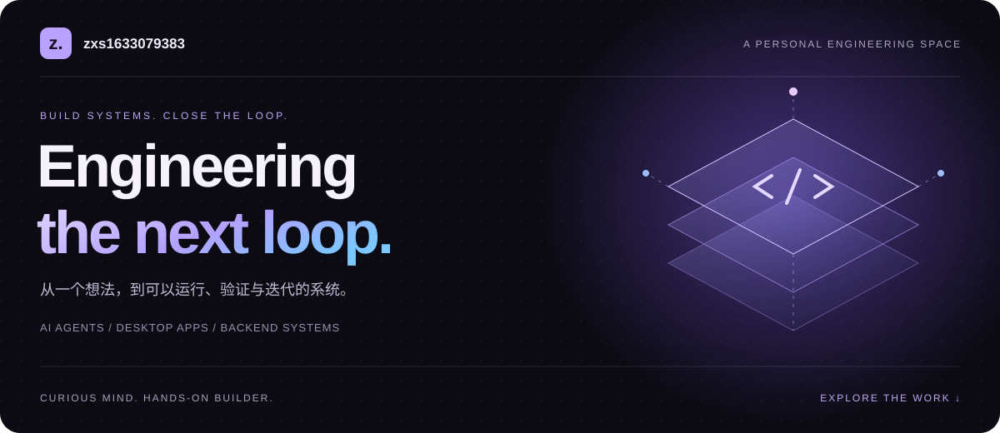
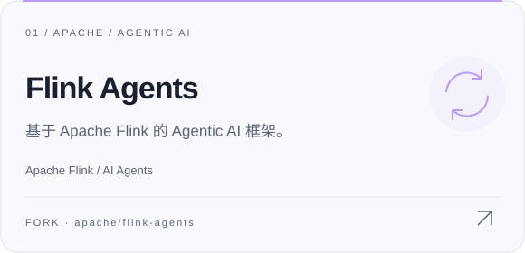
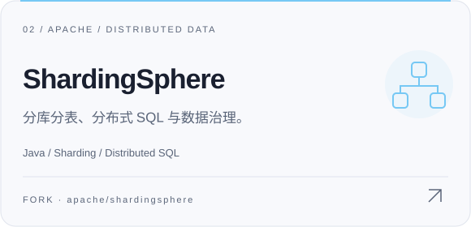
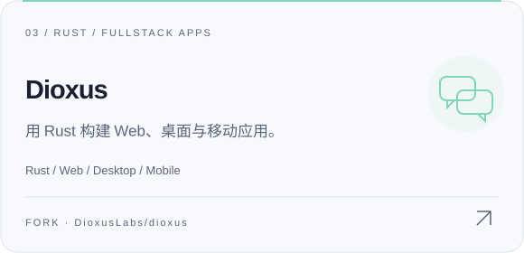

  

  <a href="#01--a-little-about-me">ABOUT / 关于</a>　·　
  <a href="#02--open-source-explorations">OPEN SOURCE / 开源</a>　·　
  <a href="#03--my-toolbox">TOOLBOX / 技术</a>　·　
  <a href="https://github.com/zxs1633079383?tab=repositories">ALL REPOS ↗</a>

 

### 01 / A little about me

**你好，我是 zxs1633079383。喜欢把不同技术连接起来，做出能运行的东西。**

从 Go / Java 后端，到 Rust / Tauri 桌面应用，再到 AI Agent 的执行与编排。这里记录我对软件系统、自动化与开发工具的探索。

> **目前关注**　Agent Runtime · 跨平台桌面 · 即时通信 · 可验证的自动化

 

### 02 / Open-source explorations

关注的开源项目：Agent 框架、分布式数据与 Rust 跨端开发。以下链接指向我的 Fork，卡片标注原始项目。

  <a href="https://github.com/zxs1633079383/flink-agents"><picture><source media="(prefers-color-scheme: dark)" srcset="./assets/flink-agents-dark.svg" /></picture></a>
  &nbsp;
  <a href="https://github.com/zxs1633079383/shardingsphere"><picture><source media="(prefers-color-scheme: dark)" srcset="./assets/shardingsphere-dark.svg" /></picture></a>

  <a href="https://github.com/zxs1633079383/dioxus"><picture><source media="(prefers-color-scheme: dark)" srcset="./assets/dioxus-dark.svg" /></picture></a>

项目说明与上游 / About these projects

- **[Flink Agents](https://github.com/zxs1633079383/flink-agents)** — 基于 Apache Flink 的 Agentic AI 框架。 上游：[apache/flink-agents](https://github.com/apache/flink-agents)。
- **[ShardingSphere](https://github.com/zxs1633079383/shardingsphere)** — 分库分表、分布式 SQL 与数据治理。 上游：[apache/shardingsphere](https://github.com/apache/shardingsphere)。
- **[Dioxus](https://github.com/zxs1633079383/dioxus)** — 用 Rust 构建 Web、桌面与移动应用。 上游：[DioxusLabs/dioxus](https://github.com/DioxusLabs/dioxus)。

 

### 03 / My toolbox

  <picture><source media="(prefers-color-scheme: dark)" srcset="./assets/stack-dark.svg" /></picture>

**关注的连接点**　后端 ↔ 桌面 · 消息 ↔ Agent · 仓库 ↔ 知识库

 

