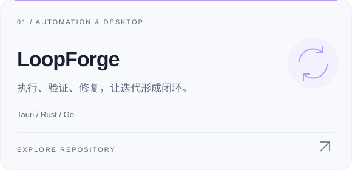
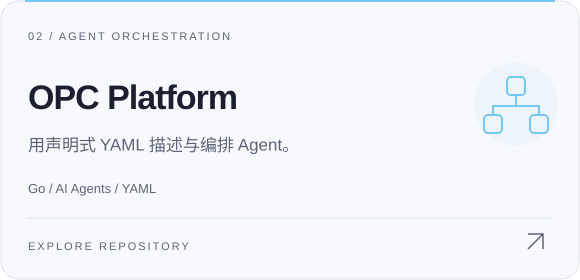
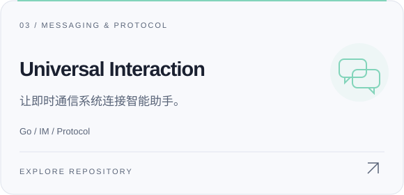
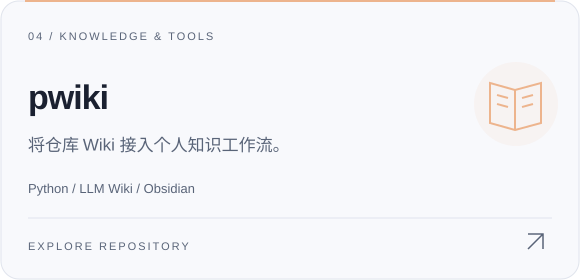

  

  <a href="#about">ABOUT / 关于</a>　·　
  <a href="#work">SELECTED WORK / 作品</a>　·　
  <a href="#stack">TOOLBOX / 技术</a>　·　
  <a href="https://github.com/zxs1633079383?tab=repositories">ALL REPOS ↗</a>

 

### 01 / A little about me

**你好，我是 zxs1633079383。喜欢把不同技术连接起来，做出能运行的东西。**

从 Go / Java 后端，到 Rust / Tauri 桌面应用，再到 AI Agent 的执行与编排。这里记录我对软件系统、自动化与开发工具的探索。

> **目前关注**　Agent Runtime · 跨平台桌面 · 即时通信 · 可验证的自动化

 

### 02 / Selected work

四个项目，四个切入点：自动化闭环、Agent 编排、交互协议与知识工具。

  <a href="https://github.com/zxs1633079383/loopforge-tauri-im"><picture><source media="(prefers-color-scheme: dark)" srcset="./assets/loopforge-dark.svg" /></picture></a>
  &nbsp;
  <a href="https://github.com/zxs1633079383/opc-platform"><picture><source media="(prefers-color-scheme: dark)" srcset="./assets/opc-dark.svg" /></picture></a>

  <a href="https://github.com/zxs1633079383/Universal_Interaction"><picture><source media="(prefers-color-scheme: dark)" srcset="./assets/uip-dark.svg" /></picture></a>
  &nbsp;
  <a href="https://github.com/zxs1633079383/pwiki"><picture><source media="(prefers-color-scheme: dark)" srcset="./assets/pwiki-dark.svg" /></picture></a>

项目说明 / Read more

- **[LoopForge](https://github.com/zxs1633079383/loopforge-tauri-im)** — 连接 Tauri 桌面层、Rust Core 与 Go 控制平面，探索执行、验证、修复与收敛的自动化循环。
- **[OPC Platform](https://github.com/zxs1633079383/opc-platform)** — 通过声明式 YAML 描述和管理 AI Agent 集群。
- **[Universal Interaction](https://github.com/zxs1633079383/Universal_Interaction)** — 与具体 IM 系统解耦的统一交互协议，用于消息系统与 Clawdbot 对接。
- **[pwiki](https://github.com/zxs1633079383/pwiki)** — 将仓库 Wiki 同步到 Obsidian，探索 LLM Wiki 查询与图谱工作流。

 

### 03 / My toolbox

  <picture><source media="(prefers-color-scheme: dark)" srcset="./assets/stack-dark.svg" /></picture>

**关注的连接点**　后端 ↔ 桌面 · 消息 ↔ Agent · 仓库 ↔ 知识库

 

